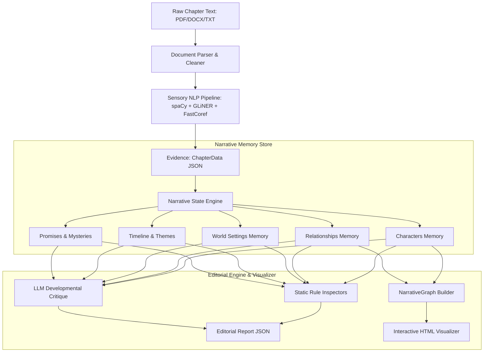

# Master Context — Narrative Intelligence Engine

The **Narrative Intelligence Engine** is a computational developmental editor designed to read, analyze, and track the evolution of complex, multi-chapter novels. Instead of running LLM reasoning over raw text (which loses context over long texts), it converts text into structured evidence, builds a versioned story memory, and critiques the narrative using rule-based inspectors and LLMs.

---

## 1. Subsystem Architecture & Data Flow

### The Three Pillars:
1.  **Evidence vs. State**: The **Sensory Pipeline** extracts observations (what was seen). The **Narrative State Engine** translates this into beliefs (what is understood). 
2.  **Chronological Versioning**: Every piece of narrative memory (e.g., character goals or traits) is stored as a `StateEntry` containing a historical list of `StateSnapshot` objects. Values are never simply overwritten; they preserve reasoning, confidence scores, and supporting evidence.
3.  **Editorial Inspections**: The **Editorial Engine** checks for plot holes, pacing gaps, voice changes, underdeveloped characters, and dangling promises without re-reading the raw text.

---

## 2. Recent Implementations & Hardening

*   **Hybrid deterministic + LLM state pipeline**: GLiNER/FastCoref/dependency-parsed relations/dialogue now run as the PRIMARY evidence source before any LLM call (fixing an earlier regression where chapters were fed to the LLM directly, bypassing the NLP layer). LLM extraction is split into four grounded stages (character/relationship, world/timeline, thematic, consistency-checker) that read the deterministic evidence plus a token-budgeted `ContextRetriever` context block — never raw text alone.
*   **ValidationEngine**: Gatekeeper between LLM proposals and canonical state — rejects new entities unsupported by deterministic evidence, applies a confidence floor, and checks field-level contradictions before writing (physical traits, status, ownership) rather than reverting after the fact.
*   **ContextRetriever**: Single-source-of-truth RAG-style context hydration from the live `NarrativeState` (or canonical `narrative_state.json` on cold start) — four-tier surgical hydration (characters, relationships, promises, world) plus themes/motifs/chapter summaries/recent timeline, token-budgeted to ~6000 chars.
*   **Noise reduction in deterministic memory (2026-07-28)**: `MysteryMemory` no longer flags bare wh-words ("who/what/why/how" appearing anywhere) or generic perception verbs ("saw", "found", "realized") as mysteries/clues — it now requires real question-punctuated sentences or strong explicit phrases ("mystery", "baffled", "remains a mystery"). `ThemeMemory` requires 2+ distinct keyword signals before introducing a brand-new theme/symbol category, and now auto-populates a `description` field for each theme/symbol instead of leaving it empty. On the 3 real chapters processed so far this cut mystery/clue noise from 56→4 entries and theme/symbol noise from 25→14, without losing genuine signal.
*   **Real sentiment & readability (2026-07-29)**: VADER (`sentiment_compound`) now runs per-scene (`scene_engine.py`) and per-chapter (`pipeline.py`) alongside the existing keyword-based emotional tone label — additive, not a replacement. `textstat` computes `flesch_reading_ease`/`flesch_kincaid_grade` in chapter style metrics.
*   **Turn-taking speaker inference (2026-07-29)**: `DialogueExtractor` adds a second pass — when a scene has exactly two known speakers (from speech-tag regex) and a quote's speaker is otherwise unresolved, it infers the other speaker via alternation (`turn_taking_inferred`, confidence 0.45). Deliberately skips scenes with 0, 1, or 3+ known speakers.
*   **Physical trait extraction fix (2026-07-29)**: `character_memory.py:_extract_trait_value` previously grabbed whatever word sat adjacent to an anchor noun ("hair", "eyes"); it now scans the sentence for an actual self-describing descriptor word (e.g. "blonde", "tall") and returns `None` rather than fabricating a value when none qualifies.
*   **Real FastCoref spans through the pipeline (2026-07-29)**: `ExtractedCoreferenceCluster.mention_spans` and `ChapterData.sentence_spans` are now populated and serialized (previously computed and discarded). Character attribution (traits, goals, fears, arc stage, inventory, location) is now driven by a per-chapter sentence→character map built from literal name matches plus resolved coreference clusters (LLM disambiguation fallback for unmatched clusters) — replacing the old, effectively-unused `coref_map` parameter on extraction methods.
*   **Test Suite**: All **93 unit and integration tests are passing** (grew from 52 as ValidationEngine/ContextRetriever/9-inspector EditorialEngine were added, to 73 with the coreference-attribution and trait-extraction fixes, to 75 with the story-graph edge tests, to 82 with the zero-shot classifier fallback/behavior tests, to 86 with the contextual-lookback tests, then to 93 with the arc-inspector/dual-ownership regression tests and the first `api/` layer tests — 2026-08-16. Full suite confirmed green: 93/93 in 96s. This number will keep moving; check `pytest -q` for the live count rather than trusting this doc).
*   **NLP Pipeline Caching**: SHA-256 caching mechanism in [pipeline.py](file:///c:/Users/RG%20Saran%20Vishakan/Desktop/Narrative_Engine/src/pipeline/pipeline.py) saves evidence packages to `data/cache/`, reducing subsequent chapter processing times from **60–90 seconds to under 0.1 seconds**.
*   **Vis.js Interactive Graph Visualizer**: `scripts/visualize_graph.py` transforms exported NetworkX graphs into a self-contained, drag-and-zoom network HTML file.
*   **Automatic `.env` Loader**: `src/utils/config.py` auto-loads credentials from `.env` on launch. LLM backend priority is Gemini → Groq → Ollama with automatic failover — note that a Gemini project with zero/exhausted quota will still spend ~60s retrying with exponential backoff before failing over to Groq.

---

## 3. How the Engine Functions & Outputs

### Core Input:
*   A chapter file (`.txt`, `.pdf`, or `.docx`) containing narrative text.

### Key Outputs (Located in `data/memory/`):
1.  **`narrative_state.json`**: The complete, serialized narrative memory containing character sheets, relationship matrices, world elements, and a timeline.
2.  **`editorial_report_ch{N}.json`**: A developmental report compiling:
    *   *Static Findings*: E.g., characters undergoing shifts without enough interaction, dead characters performing actions, or unresolved timeline events.
    *   *LLM Findings*: Deep cognitive critiques covering pacing, thematic execution, and motivation.
3.  **`narrative_graph.html`**: A Vis.js-powered visual editor workspace showing the story network (Characters = Blue, World/Locations = Green, Events = Yellow/Orange, Themes = Purple, Chapters = Gray).

---

## 4. Completion Status (honest, updated 2026-07-29)

| Feature Area | Status | Notes |
| :--- | :--- | :--- |
| **Sensory NLP pipeline (GLiNER + FastCoref + dependency relations + dialogue)** | Complete | Runs as primary evidence before any LLM call. |
| **Evolving Narrative Memory & base handlers** | Complete | Full StateEntry/StateSnapshot versioning with history. |
| **Hybrid LLM extraction + StateEngine + ValidationEngine** | Complete | Two-pass (deterministic baseline, then gated LLM refinement). |
| **ContextRetriever (RAG-style context hydration)** | Complete | Single source of truth, token-budgeted. |
| **Automated Inspectors (9) & Editorial critique** | Complete | Rule-based + LLM critique with cross-chapter context. |
| **NLP Pipeline Caching** | Complete | SHA-256 keyed. |
| **Interactive HTML Network visualizer** | Complete | Vis.js. |
| **Coreference-driven character attribution** | Complete | Real FastCoref mention/sentence spans carried through `ChapterData`; per-chapter sentence→character map (name match + resolved clusters, LLM disambiguation fallback) drives trait/goal/fear/arc extraction, replacing the old unused `coref_map` param. |
| **Sentiment (VADER) & readability (textstat)** | Complete | `sentiment_compound` per-scene/per-chapter alongside existing keyword tone; `flesch_reading_ease`/`flesch_kincaid_grade` in chapter style metrics. |
| **Dialogue turn-taking inference** | Complete | Second pass in `DialogueExtractor` alternates between the two known speakers in a scene for otherwise-unresolved quotes (confidence 0.45); skips 0/1/3+ speaker scenes. |
| **Theme/Mystery/Symbol detection** | Hybrid — keyword + optional zero-shot (2026-08-15) | `src/utils/zero_shot_classifier.py` wraps a `transformers` zero-shot-classification pipeline (`facebook/bart-large-mnli`) that, when available, batch-classifies sentences against theme/symbol/mystery/clue/revelation labels; falls back automatically (and deterministically — one load attempt, then cached `available=False`) to the original keyword+noise-reduction-gate logic when `transformers`/`torch` aren't installed or the model can't be reached. `transformers`/`torch` are optional, commented-out deps in `requirements.txt` — not required to run the engine. |
| **BookNLP, LanguageTool, DistilRoBERTa-style emotion classifier** | Not implemented | Vision docs scoped these as USE-AS-IS libraries; current code uses custom heuristics/regex plus VADER/textstat instead. |
| **Scale validation (50-100+ chapters)** | Not done | Only a handful of real chapters processed so far. |
| **Web GUI Dashboard** | Built + verified end-to-end (2026-07-31) | FastAPI (`api/`) + React/TypeScript/Tailwind SPA (`frontend/`) covering every collection (characters, relationships, world, themes/motifs, promises/mysteries/threats, conflicts/arcs, style), timeline, editorial reports, evidence-of-claim drill-down, an interactive `d3-force` Story Graph, and chapter ingestion with job history. A real chapter was ingested through the actual UI/API path (Ch. 3, 112 state changes, 81 findings, Gemini→Groq failover) confirming the full pipeline → state → editorial → graph → UI loop works. Not committed to git yet as of this writing; not load-tested at real novel scale. |

### Realistic overall completion: ~80-85% of the original vision.
The hard architectural work (evidence/state separation, hybrid deterministic+LLM grounding, validation gating, editorial reasoning over state) is done and tested. What's left is mostly refinement — replacing remaining keyword heuristics with more principled models, and validating behavior at real novel-length scale — not new subsystems.

#### Potential Extensions (Future Scope):
*   ~~**Contextual Lookback**~~ — **Done (2026-08-16).** `NarrativeState` now carries `previous_chapter_excerpt`/`previous_chapter_number` (last 1500 chars of the prior chapter's raw text, set in `src/main.py` after each chapter's delta is applied). `ContextRetriever` renders it as a fixed, unconditional `<PreviousChapterExcerpt>` tier so LLM extraction stages get direct cross-chapter continuity beyond structured state fields. Verified against the real dataset and with new unit tests (live-state, disk-fallback, and omitted-when-absent cases).
*   ~~**Richer story graph**~~ — **Done (2026-08-15/16).** `NarrativeGraph.build()` now emits `character↔world` and `character↔theme` edges derived from chapter co-occurrence (each entity's active chapters, computed from its `StateEntry` history) — world and theme nodes are no longer islands. Verified against the real dataset: 413 nodes, 826 edges (127 character↔world, 340 character↔theme, 14 relationship, 345 event↔chapter), and visually confirmed in the running dashboard. Follow-up done 2026-08-16: `GraphCanvas.tsx` now tints each edge type to match the node color it connects to (world edges green, theme edges purple) instead of every non-relationship edge looking identical — visually confirmed via zoomed screenshot.
*   **Zero-shot output quality at scale**: The new zero-shot classifier path (see completion table above) has its fallback behavior fully verified, but true `bart-large-mnli` output quality is unverified — the dev sandbox has no outbound internet access to actually download the model. Worth spot-checking theme/mystery noise levels once run in a network-enabled environment.
*   **Security fix (2026-08-16): path traversal in chapter upload.** `POST /api/ingest` joined the fully attacker-controlled upload filename straight into a filesystem path with only the extension checked — a filename like `"../../evil.txt"` escaped the intended directory, and an absolute-path filename (`"C:\Windows\System32\evil.txt"`) silently discarded the base directory entirely (a pathlib `/`-operator gotcha) and would write anywhere the process has permissions. Fixed via a `_safe_upload_filename()` helper that reduces the filename to its bare basename before any path join. First tests for the `api/` layer added (`tests/test_api.py`).
