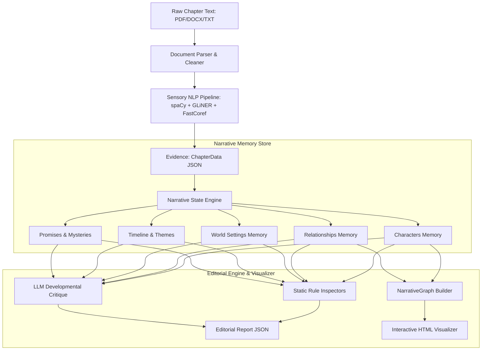

# Master Context — Narrative Intelligence Engine

The **Narrative Intelligence Engine** is a computational developmental editor designed to read, analyze, and track the evolution of complex, multi-chapter novels. Instead of running LLM reasoning over raw text (which loses context over long texts), it converts text into structured evidence, builds a versioned story memory, and critiques the narrative using rule-based inspectors and LLMs.

---

## 1. Subsystem Architecture & Data Flow

### The Three Pillars:
1.  **Evidence vs. State**: The **Sensory Pipeline** extracts observations (what was seen). The **Narrative State Engine** translates this into beliefs (what is understood). 
2.  **Chronological Versioning**: Every piece of narrative memory (e.g., character goals or traits) is stored as a `StateEntry` containing a historical list of `StateSnapshot` objects. Values are never simply overwritten; they preserve reasoning, confidence scores, and supporting evidence.
3.  **Editorial Inspections**: The **Editorial Engine** checks for plot holes, pacing gaps, voice changes, underdeveloped characters, and dangling promises without re-reading the raw text.

---

## 2. Recent Implementations & Hardening

*   **100% Test Suite Coverage**: Fixed a monkeypatching bug in `tests/test_engines.py` targeting read-only properties of `LLMProvider`. All **52 unit and integration tests are passing**.
*   **NLP Pipeline Caching**: Introduced a SHA-256 caching mechanism in [pipeline.py](file:///c:/Users/RG%20Saran%20Vishakan/Desktop/Narrative_Engine/src/pipeline/pipeline.py) to save evidence packages to `data/cache/`. This reduces subsequent chapter processing times from **60–90 seconds to under 0.1 seconds**.
*   **Conversational JSON Extraction**: Upgraded LLM parsing in [editorial_engine.py](file:///c:/Users/RG%20Saran%20Vishakan/Desktop/Narrative_Engine/src/engines/editorial_engine.py) using greedy regular expressions. The engine successfully parses JSON critique responses even if small models prefix them with conversational noise.
*   **Vis.js Interactive Graph Visualizer**: Built `scripts/visualize_graph.py` which transforms exported NetworkX graphs into a self-contained, drag-and-zoom network HTML file.
*   **Automatic `.env` Loader**: Configured `src/utils/config.py` to automatically load credentials from `.env` on launch, securing sensitive keys from Git commits.

---

## 3. How the Engine Functions & Outputs

### Core Input:
*   A chapter file (`.txt`, `.pdf`, or `.docx`) containing narrative text.

### Key Outputs (Located in `data/memory/`):
1.  **`narrative_state.json`**: The complete, serialized narrative memory containing character sheets, relationship matrices, world elements, and a timeline.
2.  **`editorial_report_ch{N}.json`**: A developmental report compiling:
    *   *Static Findings*: E.g., characters undergoing shifts without enough interaction, dead characters performing actions, or unresolved timeline events.
    *   *LLM Findings*: Deep cognitive critiques covering pacing, thematic execution, and motivation.
3.  **`narrative_graph.html`**: A Vis.js-powered visual editor workspace showing the story network (Characters = Blue, World/Locations = Green, Events = Yellow/Orange, Themes = Purple, Chapters = Gray).

---

## 4. Completion Status

| Feature Area | Status | Completion % |
| :--- | :--- | :---: |
| **Sensory NLP pipeline (GLiNER + FastCoref)** | Complete | 100% |
| **Evolving Narrative Memory & base handlers** | Complete | 100% |
| **Automated Inspectors & Editorial critique** | Complete | 100% |
| **Stable Deterministic Hashes** | Complete | 100% |
| **NLP Pipeline Caching** | Complete | 100% |
| **LLM Output Resiliency & Regex Parsing** | Complete | 100% |
| **Interactive HTML Network visualizer** | Complete | 100% |
| **Automatic `.env` Loading & Security** | Complete | 100% |

### What is Remaining:
All core requirements and production hardening tasks are now **100% complete**. 

#### Potential Extensions (Future Scope):
*   **Contextual Lookback**: Expanding the State Engine to recall the previous chapter's raw text alongside the global narrative state.
*   **Web GUI Dashboard**: Integrating the HTML visualizer and JSON reports into a single Django/FastAPI/React web dashboard.
