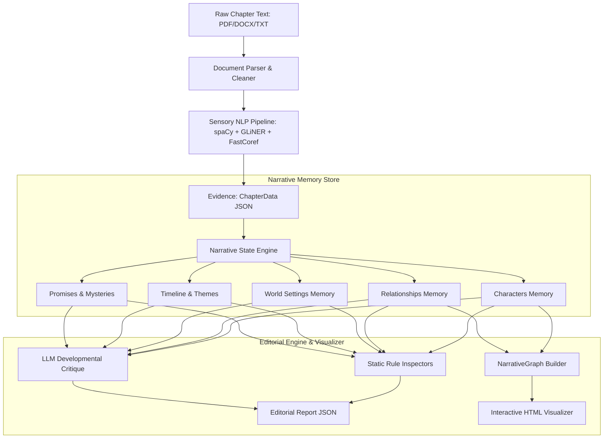

# Master Context — Narrative Intelligence Engine

The **Narrative Intelligence Engine** is a computational developmental editor designed to read, analyze, and track the evolution of complex, multi-chapter novels. Instead of running LLM reasoning over raw text (which loses context over long texts), it converts text into structured evidence, builds a versioned story memory, and critiques the narrative using rule-based inspectors and LLMs.

---

## 1. Subsystem Architecture & Data Flow

### The Three Pillars:
1.  **Evidence vs. State**: The **Sensory Pipeline** extracts observations (what was seen). The **Narrative State Engine** translates this into beliefs (what is understood). 
2.  **Chronological Versioning**: Every piece of narrative memory (e.g., character goals or traits) is stored as a `StateEntry` containing a historical list of `StateSnapshot` objects. Values are never simply overwritten; they preserve reasoning, confidence scores, and supporting evidence.
3.  **Editorial Inspections**: The **Editorial Engine** checks for plot holes, pacing gaps, voice changes, underdeveloped characters, and dangling promises without re-reading the raw text.

---

## 2. Recent Implementations & Hardening

*   **Hybrid deterministic + LLM state pipeline**: GLiNER/FastCoref/dependency-parsed relations/dialogue now run as the PRIMARY evidence source before any LLM call (fixing an earlier regression where chapters were fed to the LLM directly, bypassing the NLP layer). LLM extraction is split into four grounded stages (character/relationship, world/timeline, thematic, consistency-checker) that read the deterministic evidence plus a token-budgeted `ContextRetriever` context block — never raw text alone.
*   **ValidationEngine**: Gatekeeper between LLM proposals and canonical state — rejects new entities unsupported by deterministic evidence, applies a confidence floor, and checks field-level contradictions before writing (physical traits, status, ownership) rather than reverting after the fact.
*   **ContextRetriever**: Single-source-of-truth RAG-style context hydration from the live `NarrativeState` (or canonical `narrative_state.json` on cold start) — four-tier surgical hydration (characters, relationships, promises, world) plus themes/motifs/chapter summaries/recent timeline, token-budgeted to ~6000 chars.
*   **Noise reduction in deterministic memory (2026-07-28)**: `MysteryMemory` no longer flags bare wh-words ("who/what/why/how" appearing anywhere) or generic perception verbs ("saw", "found", "realized") as mysteries/clues — it now requires real question-punctuated sentences or strong explicit phrases ("mystery", "baffled", "remains a mystery"). `ThemeMemory` requires 2+ distinct keyword signals before introducing a brand-new theme/symbol category. On the 3 real chapters processed so far this cut mystery/clue noise from 56→4 entries and theme/symbol noise from 25→14, without losing genuine signal.
*   **Test Suite**: All **70 unit and integration tests are passing** (grew from 52 as ValidationEngine/ContextRetriever/9-inspector EditorialEngine were added — this number will keep moving; check `pytest -q` for the live count rather than trusting this doc).
*   **NLP Pipeline Caching**: SHA-256 caching mechanism in [pipeline.py](file:///c:/Users/RG%20Saran%20Vishakan/Desktop/Narrative_Engine/src/pipeline/pipeline.py) saves evidence packages to `data/cache/`, reducing subsequent chapter processing times from **60–90 seconds to under 0.1 seconds**.
*   **Vis.js Interactive Graph Visualizer**: `scripts/visualize_graph.py` transforms exported NetworkX graphs into a self-contained, drag-and-zoom network HTML file.
*   **Automatic `.env` Loader**: `src/utils/config.py` auto-loads credentials from `.env` on launch. LLM backend priority is Gemini → Groq → Ollama with automatic failover — note that a Gemini project with zero/exhausted quota will still spend ~60s retrying with exponential backoff before failing over to Groq.

---

## 3. How the Engine Functions & Outputs

### Core Input:
*   A chapter file (`.txt`, `.pdf`, or `.docx`) containing narrative text.

### Key Outputs (Located in `data/memory/`):
1.  **`narrative_state.json`**: The complete, serialized narrative memory containing character sheets, relationship matrices, world elements, and a timeline.
2.  **`editorial_report_ch{N}.json`**: A developmental report compiling:
    *   *Static Findings*: E.g., characters undergoing shifts without enough interaction, dead characters performing actions, or unresolved timeline events.
    *   *LLM Findings*: Deep cognitive critiques covering pacing, thematic execution, and motivation.
3.  **`narrative_graph.html`**: A Vis.js-powered visual editor workspace showing the story network (Characters = Blue, World/Locations = Green, Events = Yellow/Orange, Themes = Purple, Chapters = Gray).

---

## 4. Completion Status (honest, updated 2026-07-28)

| Feature Area | Status | Notes |
| :--- | :--- | :--- |
| **Sensory NLP pipeline (GLiNER + FastCoref + dependency relations + dialogue)** | Complete | Runs as primary evidence before any LLM call. |
| **Evolving Narrative Memory & base handlers** | Complete | Full StateEntry/StateSnapshot versioning with history. |
| **Hybrid LLM extraction + StateEngine + ValidationEngine** | Complete | Two-pass (deterministic baseline, then gated LLM refinement). |
| **ContextRetriever (RAG-style context hydration)** | Complete | Single source of truth, token-budgeted. |
| **Automated Inspectors (9) & Editorial critique** | Complete | Rule-based + LLM critique with cross-chapter context. |
| **NLP Pipeline Caching** | Complete | SHA-256 keyed. |
| **Interactive HTML Network visualizer** | Complete | Vis.js. |
| **Theme/Mystery/Symbol detection** | Refined, still heuristic | Keyword-based with noise-reduction gates (2026-07-28); not the topic-modeling/ML approach in the original design. |
| **Emotion/sentiment analysis, BookNLP, LanguageTool/textstat** | Not implemented | Vision docs scoped these as USE-AS-IS libraries; current code uses custom keyword heuristics instead. |
| **Scale validation (50-100+ chapters)** | Not done | Only a handful of real chapters processed so far. |
| **Web GUI Dashboard** | Not started | Future scope. |

### Realistic overall completion: ~80-85% of the original vision.
The hard architectural work (evidence/state separation, hybrid deterministic+LLM grounding, validation gating, editorial reasoning over state) is done and tested. What's left is mostly refinement — replacing remaining keyword heuristics with more principled models, and validating behavior at real novel-length scale — not new subsystems.

#### Potential Extensions (Future Scope):
*   **Contextual Lookback**: Expanding the State Engine to recall the previous chapter's raw text alongside the global narrative state.
*   **Web GUI Dashboard**: Integrating the HTML visualizer and JSON reports into a single Django/FastAPI/React web dashboard.
